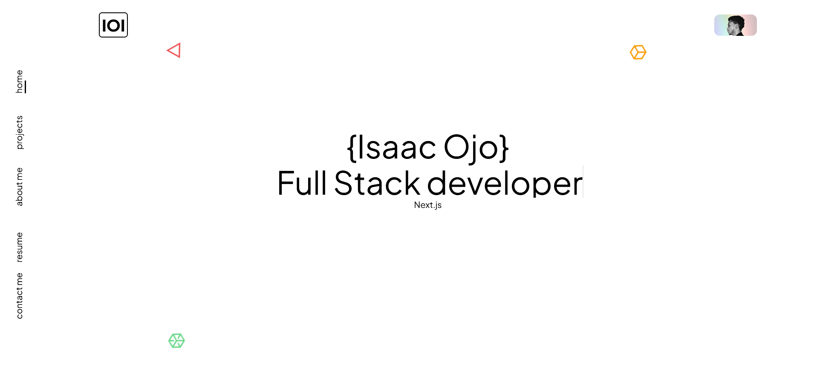
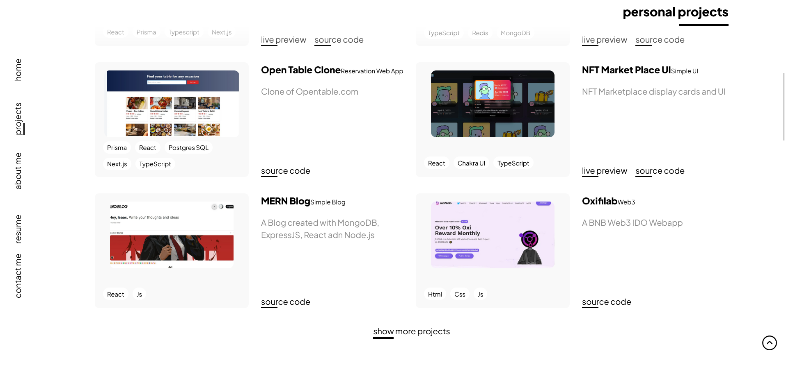

# Next.js Portfolio Web App

  
This is a web app that showcases my portfolio of projects, skills, and achievements. It is built with [Next.js], a React framework that enables fast and easy web development.

## Features

- Responsive and elegant design with [Tailwind CSS], a utility-first CSS framework.
- Dynamic and interactive pages with [React], a JavaScript library for building user interfaces.
- Server-side rendering and static site generation with [Next.js], which improves performance and SEO.
- Data fetching from [MongoDB], using prisma client
- Deployment and hosting with [Vercel], a platform that optimizes Next.js applications.

## Installation

To run this web app locally, you need to have [Node.js] and [npm] installed on your machine. Then, follow these steps:

1. Clone this repository to your local machine.
2. Navigate to the project directory and run `npm install` to install the dependencies.
3. Create a `.env` file and add your MONGODB DATABASE_URL
4. Run `npm run dev` to start the development server on http://localhost:3000
5. Enjoy!

## License

This project is licensed under the MIT License - see the LICENSE file for details.
